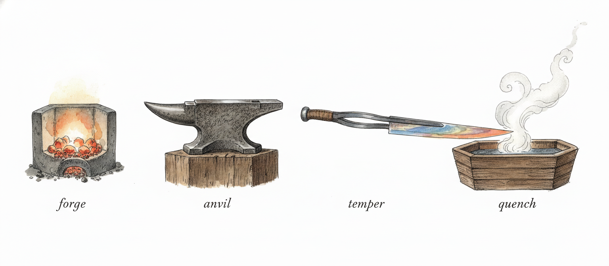
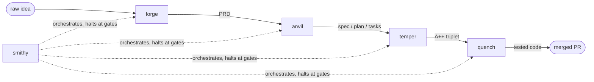

# Damascus

**Structured Prompt-Driven Development, or BDD/TDD carnival, or Spec-it-to-death.** A raw idea enters; folded, hardened, tested steel leaves. Damascus packages the SPDD pipeline — four gated stages plus an orchestrator — as skills you symlink into any repo.



## The Pipeline

| Stage | Skill | Alias | Input | Output |
|-------|-------|-------|-------|--------|
| 1 | `forge` | `prd-authoring` | raw idea | `.prd/NNN_<slug>.md` (REASONS Canvas PRD) |
| 2 | `anvil` | `speckit-decomposition` | PRD | `specs/NNN-<slug>/{spec,plan,tasks}.md` |
| 3 | `temper` | `adversarial-review-loop` | spec triplet | `review.md` with A++ rating |
| 4 | `quench` | `bdd-tdd-execution` | A++ triplet | passing BDD + TDD tests + implementation |
| ⊕ | `smithy` | `spdd-pipeline` | (any state) | drives all 4 stages, halting at every gate |



**Golden Rule (Fowler):** when reality diverges from the prompt, fix the prompt before the code.

Every stage halts at its gate for user signoff. State lives in the disk artifacts, so `smithy` can resume any feature from any point. For one-line typos and hotfixes: skip the pipeline and just fix it — SPDD is for non-trivial work.

### Temper: the adversarial review loop

Temper needs **no external API**. Each round, three critic subagents with distinct lenses (completeness, feasibility, testability) try to *refute* the spec triplet; a judge dedupes findings and assigns a rating. Blocking findings are applied, the round is logged, and the loop repeats. **A++ requires two consecutive rounds with zero blocking findings** (max 5 rounds, then escalate). The full trail lives in `specs/NNN-<slug>/review.md`, append-only.

## Requirements

- git ≥ 2.13 (submodules)
- bash 3.2+ (`install.sh` runs on stock macOS bash)
- a filesystem with symlink support

## Install

From your repo root, pinning a release tag:

```bash
git submodule add <this-repo-url> vendor/damascus
git -C vendor/damascus checkout v0.1.0        # pin a release, not a moving branch
git submodule update --init --recursive
./vendor/damascus/install.sh
git add .gitmodules vendor/damascus && git commit -m "chore: vendor damascus v0.1.0"
```

This symlinks into your `.claude/`:

- the 5 stage skills + 5 aliases → `.claude/skills/`
- 5 quench agents (`bdd-scenario-writer`, `tdd-test-generator`, `playwright-e2e-tester`, `fastapi-implementer`, `labcoat`) → `.claude/agents/`
- the KEEP-class [obra/superpowers](https://github.com/obra/superpowers) skills (see policy below) → `.claude/skills/`

Re-run any time to refresh; the install prunes damascus-owned links whose names are no longer shipped. Other modes:

```bash
./vendor/damascus/install.sh --verify      # link health report; exit 1 if repair is needed
./vendor/damascus/install.sh --dry-run     # print planned actions, touch nothing
./vendor/damascus/install.sh --uninstall   # removes everything it owns and nothing else
```

`--verify` output is the first thing to include in a bug report.

## Upgrading

```bash
git -C vendor/damascus fetch --tags
git -C vendor/damascus checkout v0.2.0     # the new release
git submodule update --init --recursive
./vendor/damascus/install.sh               # idempotent: refreshes and prunes
git add vendor/damascus && git commit -m "chore: bump damascus to v0.2.0"
```

Breaking changes to skill contracts or `install.sh` behavior are called out in [CHANGELOG.md](CHANGELOG.md) and, past 1.0, bump the major version.

## Vendored Submodules

| Submodule | Pin | Role |
|-----------|-----|------|
| [obra/superpowers](https://github.com/obra/superpowers) | v4.3.1 | process-discipline skills; KEEP-class linked at install |
| [github/spec-kit](https://github.com/github/spec-kit) | v0.10.1 | `anvil`'s fallback templates (`templates/{spec,plan,tasks}-template.md`) when `/speckit.*` slash commands aren't registered |

## Superpowers Policy (DENY / KEEP / CONDITIONAL)

The pipeline stages are the canonical entrypoints. Three upstream skills overlap them and are **DENY** — not linked at install, and each stage skill carries redirect language:

| Upstream skill | Policy | Use instead |
|----------------|--------|-------------|
| `brainstorming` | DENY | `forge` — structured elicitation with a durable PRD artifact |
| `writing-plans` | DENY | `anvil` — 3-file spec-kit-shaped artifact set |
| `executing-plans` | DENY | `quench` (or `smithy` cross-stage) — BDD-first, red-amber-green |
| `test-driven-development` | CONDITIONAL | linked; quench **overrides** its red-green cycle with red-amber-green |
| remaining 10 skills | KEEP | linked as-is (`systematic-debugging`, `verification-before-completion`, `finishing-a-development-branch`, …) |

**Red-amber-green:** standard TDD goes red → green. Quench inserts **amber** — the test must fail *for the right reason* (the assertion you care about, not an import error) before any implementation is written. Amber is the moment you trust the test.

## Layout

```
skills/{forge,anvil,temper,quench,smithy}/SKILL.md   the five stages
skills/<alias> -> <stage>                            invocation aliases
agents/*.md                                          quench's dispatch agents
vendor/superpowers                                   pinned submodule
vendor/spec-kit                                      pinned submodule
install.sh                                           consumer-side symlinker
```

## Optional host-repo integrations

The skills degrade gracefully — each of these is used when present and skipped silently when not:

- **Board projection** — if your repo has a kanban/state sync script, each stage gate runs it once
- **Phase signalling** — if your repo has a status-bar helper (e.g. tmux), quench calls it at red/amber/green transitions
- **Drift detection** — if a pre-commit hook flags code changes without spec changes, smithy halts on it

## Support & license

Maintained by one person; issues are welcome and responses are best-effort. Please include your OS, `bash --version`, and `install.sh --verify` output when reporting installer problems.

MIT licensed (see [LICENSE](LICENSE)). The vendored submodules `vendor/superpowers` and `vendor/spec-kit` retain their own upstream licenses and are not relicensed by this repo.

## Credits

- Martin Fowler — [*Structured Prompt-Driven Development*](https://martinfowler.com/articles/structured-prompt-driven/) (REASONS Canvas, Golden Rule)
- [obra/superpowers](https://github.com/obra/superpowers) — process-discipline skills
- [github/spec-kit](https://github.com/github/spec-kit) — spec-driven development toolkit
