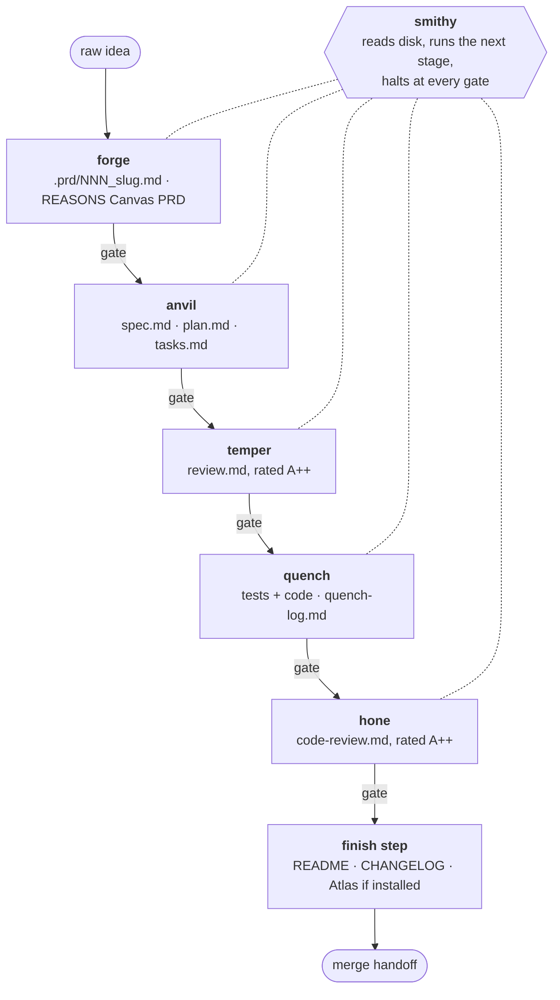
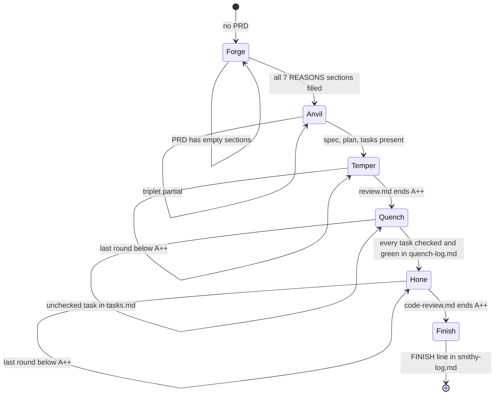
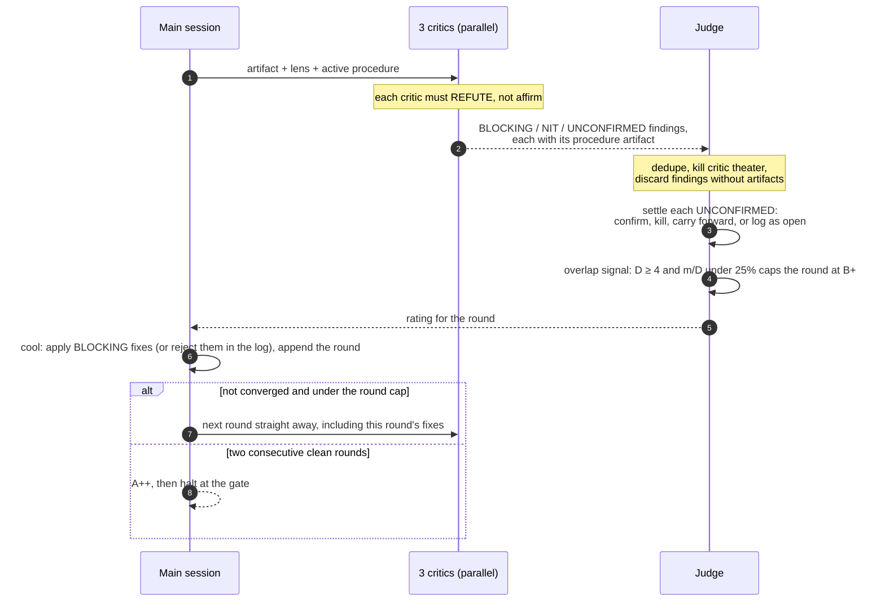
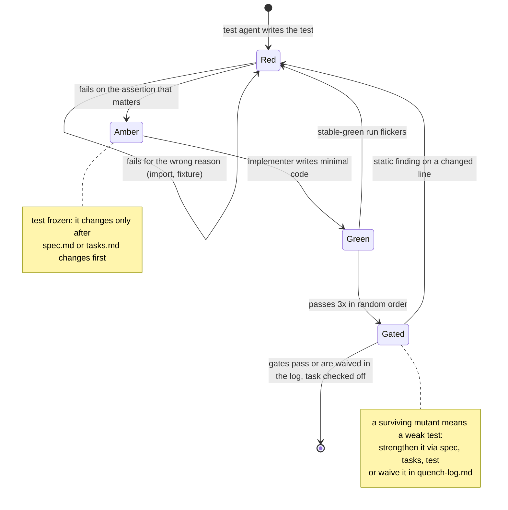
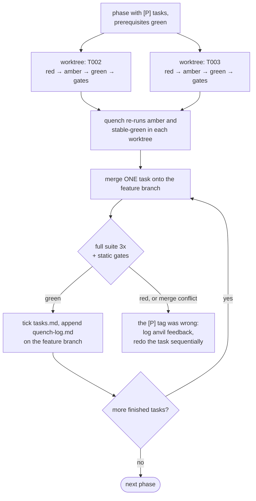
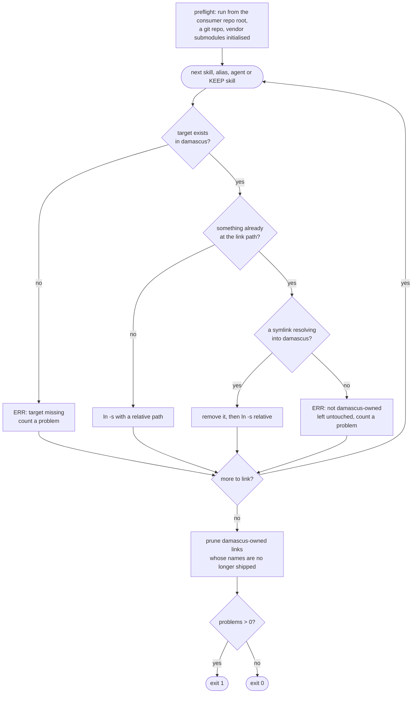
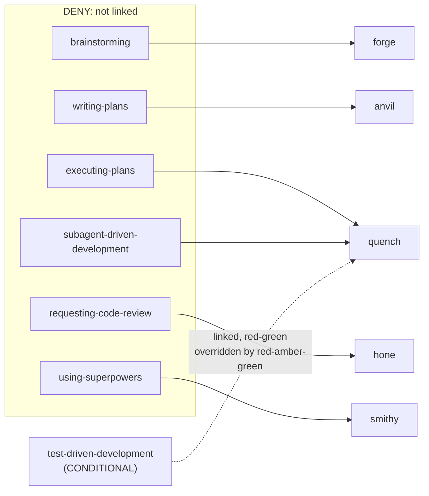

# Architecture

The pipeline's contracts, drawn. Each diagram is a picture of rules that live in a
`SKILL.md` body or in `install.sh` — those files are the source of truth, and each
section links the one it draws. Every diagram is a ` ```mermaid ` block, so this page
renders the same on GitHub and in the Sphinx build.

## The pipeline and its artifacts

Five stages, each halting at a gate for your signoff. Every stage reads the artifact the
previous one wrote and refuses to start without it; state lives on disk, never in a
session's memory.



Source: [`skills/smithy/SKILL.md`](https://github.com/forkrul/damascus_development/blob/master/skills/smithy/SKILL.md)

## Smithy's state machine

Smithy is stateless: every state below is decided from the files under `.prd/` and
`specs/NNN-slug/` alone, so `smithy --resume` works after any halt, in any session.



Between two states smithy always halts, and the handoff leads with **Needs your call** —
waivers, freeze exceptions, rejected or open findings, unconfirmed assumptions, bypasses —
before **Changed** and **Found**. Inside a stage it does not stop: a finished quench task
or review round is not a gate.

Source: [`skills/smithy/SKILL.md`](https://github.com/forkrul/damascus_development/blob/master/skills/smithy/SKILL.md)

## The adversarial review round (temper and hone)

Temper reviews the spec triplet; hone reviews the implementation diff in units of at
most ~400 changed lines. Both run the same round, entirely local.



A round is **clean** only with zero BLOCKING findings, no UNCONFIRMED carried forward, no
overlap cap — and, in hone, only if the previous round's fixes were in the diff its critics
saw. Temper's blocking findings quote the question an implementer would have to ask; hone's
carry a repro (a failing test, an input or a command), and every hone fix is shown to fail
without itself. Temper caps at 5 rounds, hone at 3; hitting the cap escalates to you.

Sources: [`skills/temper/SKILL.md`](https://github.com/forkrul/damascus_development/blob/master/skills/temper/SKILL.md) ·
[`skills/hone/SKILL.md`](https://github.com/forkrul/damascus_development/blob/master/skills/hone/SKILL.md)

## Red-amber-green, per task

Standard TDD goes red → green. Quench inserts **amber**: the test must fail for the
right reason before any implementation exists — and from amber on, the test is frozen.



Quench re-runs every amber and green an agent reports before it counts; the agent's
report is a claim, not evidence. Test agents never write implementation, and the
implementer never edits tests. When every task is done, the FR ↔ test traceability sweep
must report no untested FR.

Source: [`skills/quench/SKILL.md`](https://github.com/forkrul/damascus_development/blob/master/skills/quench/SKILL.md)

## Parallel `[P]` tasks

Inside a task the cycle is sequential. Across tasks, the `[P]` tasks of one phase may
run side by side — and still land one at a time.



Source: [`skills/quench/SKILL.md`](https://github.com/forkrul/damascus_development/blob/master/skills/quench/SKILL.md)

## How `install.sh` places a link

The installer only ever touches symlinks that resolve into the damascus checkout, writes
only relative links, and exits non-zero if any link could not be placed.



`--verify` walks the same list and reports missing, foreign, broken, mis-targeted and stale
links; `--uninstall` removes every damascus-owned link and nothing else; `--dry-run` prints
the plan and touches nothing.

Source: [`install.sh`](https://github.com/forkrul/damascus_development/blob/master/install.sh)

## Superpowers policy

Six upstream [obra/superpowers](https://github.com/obra/superpowers) skills are never
linked, because a stage replaces them or they route into one that does.



The seven KEEP skills (`systematic-debugging`, `dispatching-parallel-agents`,
`verification-before-completion`, `receiving-code-review`, `finishing-a-development-branch`,
`using-git-worktrees`, `writing-skills`) are linked as-is. CI fails when an upstream skill is
neither KEEP in `install.sh` nor a DENY row in the README.

Source: [`README.md`](https://github.com/forkrul/damascus_development/blob/master/README.md#superpowers-policy-deny--keep--conditional)
