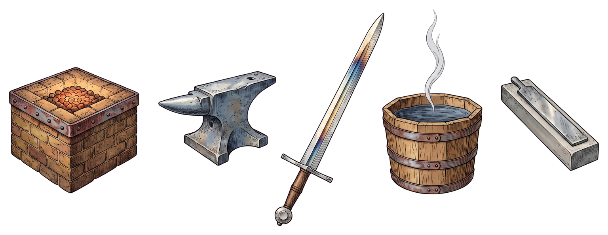

# damascus

**Structured Prompt-Driven Development as Claude Code skills.** A raw idea enters; folded,
hardened, tested steel leaves: five gated stages — forge → anvil → temper → quench → hone —
orchestrated by smithy and symlinked into any repo by `install.sh`.



The stage and agent pages below are generated at build time from the files that
ship — `skills/*/SKILL.md` and `agents/*.md` — so the contract you read here is the
contract your agents load. [Architecture](architecture.md) draws the same contracts as
diagrams.

```{toctree}
:caption: Start here
:maxdepth: 1

_generated/overview
architecture
```

```{toctree}
:caption: Pipeline stages
:maxdepth: 1

_generated/skills/smithy
_generated/skills/forge
_generated/skills/anvil
_generated/skills/temper
_generated/skills/quench
_generated/skills/hone
```

```{toctree}
:caption: Quench agents
:maxdepth: 1

_generated/agents/bdd-scenario-writer
_generated/agents/tdd-test-generator
_generated/agents/playwright-e2e-tester
_generated/agents/fastapi-implementer
_generated/agents/labcoat
```

```{toctree}
:caption: Worked example
:maxdepth: 1

_generated/examples/index
_generated/examples/prd
_generated/examples/spec
_generated/examples/plan
_generated/examples/tasks
_generated/examples/review
_generated/examples/quench-log
_generated/examples/code-review
_generated/examples/smithy-log
```

```{toctree}
:caption: Project
:maxdepth: 1

_generated/contributing
production-readiness
assets/README
_generated/changelog
```
